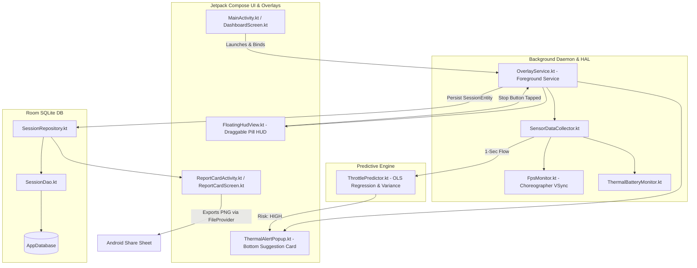

# 🛡️ Thermal & Performance Guardian

[](https://kotlinlang.org/)
[](https://developer.android.com/jetpack/compose)
[](https://developer.android.com)
[](https://developer.android.com/training/data-storage/room)
[](https://www.linkedin.com/in/saurabh-jamdade-b98259373/)

> **Real-Time Predictive Thermal Throttling Mitigation & Esports Performance HUD for Android & Web.**  
> *Developed for the 30-Hour iQOO Performance Engineering Hackathon.*

---

## 📌 Table of Contents
- [Overview](#-overview)
- [Key Features](#-key-features)
- [System Architecture](#-system-architecture)
- [Predictive Intelligence & Math](#-predictive-intelligence--math)
- [UI & Esports Design System](#-ui--esports-design-system)
- [Project Directory Structure](#-project-directory-structure)
- [Getting Started](#-getting-started)
- [Permissions & Privacy](#-permissions--privacy)
- [Testing & Quality Assurance](#-testing--quality-assurance)
- [Author & Connect](#-author--connect)

---

## 🚀 Overview

Mobile gaming on high-refresh-rate flagships pushes SoCs to their physical thermal limits. Standard Android behavior simply throttles CPU/GPU frequencies abruptly once hardware junction temperatures hit critical thresholds ($45^\circ\text{C}+$ / Thermal Status Severe), resulting in catastrophic frame drops, stutter, and battery degradation. Furthermore, raw kernel sysfs thermal zones (`/sys/class/thermal/thermal_zone*`) are restricted by SELinux on unrooted OEM devices.

**Thermal & Performance Guardian** solves this through a lightweight, proactive approach:
1. **Trend-Based Prediction (No Heavy ML)**: Analyzes 15-second rolling linear regression slopes ($dTemp/dt$), frame-pacing variance ($\sigma^2_{\text{FPS}}$), and battery discharge rates to predict thermal throttling **before** it causes frame drops.
2. **Non-Intrusive Draggable Pill HUD**: Overlays real-time gameplay metrics (Temp, FPS, Battery %, Risk Dot) in a single compact row using `WindowManager.LayoutParams.TYPE_APPLICATION_OVERLAY`.
3. **Proactive Suggestion Card**: Triggers an actionable suggestion popup (*"Reduce refresh rate to 90Hz?"*) when risk escalates to `HIGH`.
4. **Post-Session Report Card**: Summarizes session efficiency, throttling events avoided, dual Canvas trend line graphs, and 1-tap PNG export via Android `FileProvider`.
5. **Interactive Esports Web Simulator**: Standalone 60 FPS playable space-runner simulator with live telemetry injection and console boot splash sequence.

---

## ⚡ Key Features

| Feature | Description | File Reference |
| :--- | :--- | :--- |
| **Real-Time Sensor Aggregation** | Universal battery thermal proxy (`EXTRA_TEMPERATURE`), `Choreographer` 1-sec rolling FPS, and discharge current monitoring. | [`SensorDataCollector.kt`](app/src/main/java/com/thermalguardian/app/collector/SensorDataCollector.kt) |
| **Predictive Throttle Engine** | 15s rolling window Ordinary Least Squares (OLS) slope, FPS stability variance, and battery acceleration model. | [`ThrottlePredictor.kt`](app/src/main/java/com/thermalguardian/app/predictor/ThrottlePredictor.kt) |
| **Draggable Pill HUD** | Top-left compact overlay (`COSMIC_VOID_v1.0` + Status Dot + Temp + Cyan FPS + Battery % + Stop Button). | [`FloatingHudView.kt`](app/src/main/java/com/thermalguardian/app/ui/overlay/FloatingHudView.kt) |
| **Thermal Alert Popup** | Bottom-anchored card with cyan border glow alerting users with actionable suggestions when risk is `HIGH`. | [`ThermalAlertPopup.kt`](app/src/main/java/com/thermalguardian/app/ui/overlay/ThermalAlertPopup.kt) |
| **Post-Session Report Card** | Full-screen summary displaying events avoided, Temperature/FPS Canvas sparkline graphs, and session efficiency. | [`ReportCardScreen.kt`](app/src/main/java/com/thermalguardian/app/ui/screens/ReportCardScreen.kt) |
| **Room DB Persistence** | Stores complete session metrics, telemetry time-series, and performance grades (`S`, `A`, `B`, `C`, `D`). | [`AppDatabase.kt`](app/src/main/java/com/thermalguardian/app/data/db/AppDatabase.kt) |
| **Thermal Fallback Mode** | Gracefully falls back to battery discharge rate & FPS stability models if OEM hardware thermal APIs are unavailable. | [`SensorDataCollector.kt`](app/src/main/java/com/thermalguardian/app/collector/SensorDataCollector.kt) |
| **Web Demo Simulator** | Interactive browser simulator with 60 FPS canvas game, live sliders, iQOO watermark, and console boot intro. | [`web_demo/index.html`](web_demo/index.html) |

---

## 🏗️ System Architecture



---

## 🧮 Predictive Intelligence & Math

Instead of opaque, battery-draining on-device neural networks, **Thermal & Performance Guardian** utilizes mathematically deterministic, ultra-low-overhead statistical metrics computed over a 15-second sliding window:

### 1. Temperature Rate of Change ($dTemp/dt$)
Uses Ordinary Least Squares (OLS) Linear Regression to compute the instantaneous temperature slope:
$$\text{Slope (per second)} = \frac{n \sum (t \cdot T) - \sum t \sum T}{n \sum t^2 - (\sum t)^2}$$
$$\text{Rate of Change (}^\circ\text{C}/10\text{s)} = \text{Slope} \times 10$$

### 2. FPS Stability Variance ($\sigma^2_{\text{FPS}}$)
Measures frame pacing stutter and jitter across the rolling window:
$$\sigma^2 = \frac{1}{N} \sum_{i=1}^{N} (\text{FPS}_i - \mu_{\text{FPS}})^2$$

### 3. Session Efficiency Score
Measures the percentage of gameplay time spent in optimal thermal and frame conditions:
$$\text{Efficiency \%} = \left(\frac{\text{Seconds spent at LOW Risk}}{\text{Total Session Seconds}}\right) \times 100$$
- 🟢 **Green**: $\ge 85.0\%$ (Optimal thermal efficiency)
- 🟡 **Yellow**: $60.0\% - 84.9\%$ (Moderate thermal build-up)
- 🔴 **Red**: $< 60.0\%$ (Heavy thermal throttling experienced)

### 4. Throttling Events Avoided Counter
Counts state transitions where risk escalated to `MEDIUM`/`HIGH` and returned back to `LOW`/`MEDIUM` without a catastrophic frame collapse ($\text{FPS} \ge 30$), proving proactive intervention succeeded.

---

## 🎨 UI & Esports Design System

- **Color Palette**:
  - **Cyber Dark (`#0A0A0F` / `#07080E`)**: Deep OLED-optimized black background with subtle diagonal cyber-grid gradient.
  - **Neon Cyan (`#00F0FF`)**: Framerate telemetry, positive stats, graph glow strokes, and primary CTA buttons.
  - **Neon Magenta (`#B026FF`)**: Battery drain indicators, secondary alerts, and particle accents.
  - **Electric Amber (`#FFB300`)**: Temperature line graph & moderate-risk warnings.
  - **Thermal Crimson (`#FF0055`)**: Imminent throttling warnings and status dot strobe.
- **Esports Typography**:
  - Monospace / Sci-Fi: **`Orbitron`** & **`JetBrains Mono`** for all numeric values, FPS meters, and temperatures.
  - Clean Body: **`Rajdhani`** & **`Inter`** for legible in-game readouts.
- **Chamfered Geometry**: Angular gaming cuts (`clip-path: polygon(...)`) across buttons, cards, HUD pill, and phone chassis.

---

## 📂 Project Directory Structure

```
Thermal_&_Guardian/
├── app/
│   ├── build.gradle.kts                   # Dependencies (Compose BOM, Room, Coroutines, KSP)
│   ├── proguard-rules.pro                 # Release obfuscation rules
│   └── src/
│       ├── main/
│       │   ├── AndroidManifest.xml        # Permissions, FileProvider, Service declarations
│       │   ├── java/com/thermalguardian/app/
│       │   │   ├── ThermalGuardianApp.kt   # Application context & notification channel setup
│       │   │   ├── collector/
│       │   │   │   ├── FpsMonitor.kt      # Choreographer 1-sec VSync frame pacing
│       │   │   │   ├── ThermalBatteryMonitor.kt # Sticky battery broadcast parser
│       │   │   │   └── SensorDataCollector.kt   # Master sensor aggregator & Flow streams
│       │   │   ├── predictor/
│       │   │   │   └── ThrottlePredictor.kt     # OLS regression slope & variance scoring
│       │   │   ├── service/
│       │   │   │   └── OverlayService.kt  # Foreground service & Room logger
│       │   │   ├── data/
│       │   │   │   ├── model/             # MetricSample, RiskLevel, ThrottlePrediction, SessionSummary
│       │   │   │   ├── db/                # SessionEntity, SessionDao, AppDatabase
│       │   │   │   └── repository/        # SessionRepository
│       │   │   └── ui/
│       │   │       ├── MainActivity.kt    # Permission onboarding & auto-launch
│       │   │       ├── ReportCardActivity.kt # Session report & PNG export sharing
│       │   │       ├── overlay/
│       │   │       │   ├── FloatingHudView.kt    # Draggable single-row pill HUD
│       │   │       │   └── ThermalAlertPopup.kt  # Bottom suggestion popup
│       │   │       ├── screens/
│       │   │       │   ├── DashboardScreen.kt    # Live hardware meter dashboard
│       │   │       │   └── ReportCardScreen.kt   # Figma-accurate Canvas report screen
│       │   │       ├── theme/             # Color.kt, Theme.kt, Type.kt
│       │   │       └── util/              # Formatters.kt, PermissionHelper.kt
│       │   └── res/                       # XML resources, adaptive icons, FileProvider paths
│       └── test/java/com/thermalguardian/app/
│           ├── ThrottlePredictorTest.kt   # Unit tests for Low/Med/High thresholds & math
│           └── SessionSummaryTest.kt      # Unit tests for efficiency scoring & grading
├── web_demo/
│   ├── index.html                         # Interactive 60 FPS Web Esports HUD Simulator
│   └── assets/
│       └── iqoo_logo.png                  # iQOO brand assets
├── build.gradle.kts                       # Root build configuration
├── settings.gradle.kts                    # Project module settings
└── README.md                              # Project Documentation
```

---

## 🛠️ Getting Started

### 📱 Android Application Setup

1. **Prerequisites**:
   - Android Studio Iguana / Jellyfish or newer.
   - JDK 17.
   - Android SDK 34 (Minimum SDK API 26 / Android 8.0).
2. **Clone & Open**:
   ```bash
   git clone https://github.com/your-repo/Thermal_and_Guardian.git
   cd Thermal_and_Guardian
   ```
3. **Build & Run Unit Tests**:
   ```bash
   # Run all JUnit prediction & algorithm tests
   ./gradlew test
   
   # Assemble Debug APK
   ./gradlew assembleDebug
   ```
4. **Deploy to Device**:
   - Connect your Android device with USB Debugging enabled.
   - Run from Android Studio or execute:
     ```bash
     ./gradlew installDebug
     ```
   - Grant the `SYSTEM_ALERT_WINDOW` ("Display over other apps") permission on first launch.

---

### 🌐 Full-Stack Cloud Deployment (Frontend on Vercel + Backend on Render)

```
┌────────────────────────────────────────────────────────┐
│               FRONTEND (Vercel CDN)                    │
│   • 60 FPS Esports Simulator & Pill HUD                │
│   • Console Boot Glitch Intro & Cyber Cursor           │
│   • Live Telemetry Canvas & Session Report             │
└───────────────────────────┬────────────────────────────┘
                            │ HTTPS / REST API
┌───────────────────────────▼────────────────────────────┐
│              BACKEND (Render Web Service)              │
│   • OLS Linear Regression Predictive Slope Engine      │
│   • FPS Variance & Battery Acceleration Scoring        │
│   • Persistent Session Database & Health API           │
└────────────────────────────────────────────────────────┘
```

#### 1. Deploying Frontend to Vercel
- **Automatic via Vercel Dashboard**:
  1. Go to [https://vercel.com](https://vercel.com) $\to$ Click **Add New Project**.
  2. Import your GitHub repository (`Thermal_and_Guardian`).
  3. Framework Preset: **Other / Static** (Root directory: `./`).
  4. Click **Deploy**!
  5. Your frontend is live with ultra-low latency CDN at `https://your-app.vercel.app`.

#### 2. Deploying Backend API to Render (Free Web Service)
- **Automatic via Blueprint (`render.yaml`)**:
  1. Go to [https://render.com](https://render.com) $\to$ Click **New +** $\to$ Select **Blueprint**.
  2. Connect your GitHub repository. Render reads [`render.yaml`](render.yaml) and deploys automatically!
- **Or Manual Setup**:
  1. Click **New +** $\to$ Select **Web Service**.
  2. Set **Root Directory**: `backend`
  3. **Build Command**: `npm install`
  4. **Start Command**: `npm start`
  5. Your API is live at `https://thermal-guardian-api.onrender.com`.

#### 3. Connecting Frontend to Backend
- Open your Vercel web app $\to$ Click the purple badge **`RENDER API: LOCAL`** in the top header $\to$ Paste your Render API URL (e.g. `https://thermal-guardian-api.onrender.com`) $\to$ The badge turns glowing green **`RENDER API: ONLINE (24ms)`**!

#### 4. Running Locally
```bash
# Start Backend API (Port 5000)
cd backend
npm install
npm start

# In another terminal: Start Web Frontend (Port 8080)
cd web_demo
python -m http.server 8080
# Open http://localhost:8080 in your browser
```

---

## 🔒 Permissions & Privacy

Thermal & Performance Guardian runs **100% on-device** and requires **zero network access** or external cloud dependencies:

- `SYSTEM_ALERT_WINDOW`: Required to render the non-intrusive draggable floating pill HUD over active games.
- `FOREGROUND_SERVICE` & `FOREGROUND_SERVICE_SPECIAL_USE`: Ensures uninterrupted telemetry logging during gameplay sessions.
- `POST_NOTIFICATIONS`: Displays persistent notification controls for session management (Android 13+).
- `HIGH_SAMPLING_RATE_SENSORS`: Enables precise Choreographer frame delivery monitoring.

---

## 🧪 Testing & Quality Assurance

The predictive engine is validated with dedicated unit test suites:

- **`ThrottlePredictorTest.kt`**:
  - `testLowRisk_slowTempRiseAndStableFps`: Verifies $dTemp/dt < 0.3^\circ\text{C}/10\text{s}$ triggers `LOW`.
  - `testMediumRisk_moderateTempRise`: Verifies $dTemp/dt \in [0.3, 0.6]^\circ\text{C}/10\text{s}$ triggers `MEDIUM`.
  - `testMediumRisk_highFpsVariance`: Verifies FPS variance $\ge 20.0$ triggers `MEDIUM`.
  - `testHighRisk_fastTempRiseAndFpsDropping`: Verifies $dTemp/dt > 0.6^\circ\text{C}/10\text{s}$ with frame drop triggers `HIGH`.
  - `testFallbackMode_whenTemperatureUnavailable`: Verifies seamless battery discharge fallback model.
  - `testMathCalculations_slopeAndVariance`: Validates OLS linear slope regression and population variance calculations.
- **`SessionSummaryTest.kt`**:
  - Validates efficiency percentage calculations, grade score assignment, and duration formatters.

---

## 👨‍💻 Author & Connect

Developed with passion for mobile performance engineering and gaming optimization.

**Saurabh Jamdade**  
🔗 **LinkedIn**: [https://www.linkedin.com/in/saurabh-jamdade-b98259373/](https://www.linkedin.com/in/saurabh-jamdade-b98259373/)  

---

<div align="center">
  <sub>Built for the iQOO Performance Engineering Hackathon • Thermal & Performance Guardian</sub>
</div>
